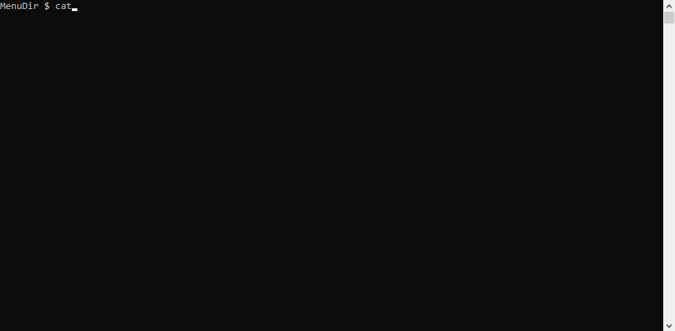

<head>
 <meta name="google-site-verification" content="EOPX9a1C52LiWEy2FH2HPkPlsR9e2_mWI7XxQ9FV4zI" />
</head>

Background
==========
I wrote this menu.c back in the 90's for an IBM AIX system running some PICK applications, used by users to launch programs, sysadmins to run jobs etc.
Modified to run on Ubuntu (should compile fine on other platforms - it's pretty basic).  I've picked this back up and updating, cleaning up the code and releasing enhanced versions.

NOTE:
 - The menu app will decide whether to draw the menu in one or two columns (curses) depending on how many entries are in the menufile (newt version is a list).
 - If you use it or modify it, I'd appreciate a mention in the source code (taking into account [](https://www.gnu.org/licenses/gpl-3.0) ) - drop me an email to let me know what you're using it for, I'd be really interested.
 - If you are editing the menufiles with a DOS editor, run them through dos2unix before using in the menu or they will produce unexpected results.



Build on Ubuntu 16.04
=====================
1. Install curses libraries: `sudo apt-get install libncurses5-dev libncursesw5-dev`
2. Install newt libraries: `sudo apt-get install libnewt-dev`
3. Compile the menu.c: `gcc -o menu menu.c -lncurses -lnewt`
4. Create a menu file - sample in repo
5. Start it up - see usage below

Usage
=====
 - `$ menu -c menufile` (display the menufile using simple curses based menu)
 - `$ menu -n menufile` (display the menufile using newt character graphics menu)
 - NOTE: In the menufile you can call menus of other types (e.g. a newt menu can call a curses menu) but you have to hard code that into the menufile - example in the repo (menufile calls menufile2 as a curses menu).

menufile - format
=================
 - NOTE: If you exceed these lengths the program will throw an error (the error will provide guidance on how long the string is and which one).
   - Max length of description line is 30 chars
   - Max length of each command line is 80 chars.
   - TIP: If you're in any doubt just wrap your commands up in a script - much easier and makes for a tidier menufile.
 - NOTE: The program does not check if you have exceeded the maximum number of menu options - the program simply grabs the first 30 and will ignore the rest
   - Max number of options - 30.

```
Line 1 - Menu Heading - heading at top of screen
Line 2 - Menu Description - heading at top of menu
Option 1 - Menu option description that will appear on the menu
Option 1 - command to run: either commands, call a shell script (if longer than 80 chars). Note: could also call another menu
Option 2 - Menu option description that will appear on the menu
Option 2 - command to run
Option.....
```

Planned Updates
===============
As time permits - here's the plan:
 - General Cleanup
   - [x] Clear up the compilation warnings
   - [x] Add some error checking to deal with the TTY segmentation violation errors
 - Enhancements
   - [x] Remove the old 'OFF' ways of exiting the screen and just use Q/q
   - [x] Modify program to create a more TUI style menu - done using newt library
 - General code improvements
   - [x] Changed kerbpass to passwd
   - [x] Fixed a bug where after an execution the menu would redraw and leave the last menu option number selected displayed at the bottom of the screen - there was an redundant printw() - echo() had already been set
   - [x] Handle the lines longer than 30 or 80 chars so it doesn't mess up the menu

 - NOTE: For further planned updated please see Github issues where I'll be trakcing changes (https://github.com/steveh250/Unix-Menu-Program/issues).

Licensing
=========
[](https://www.gnu.org/licenses/gpl-3.0)

